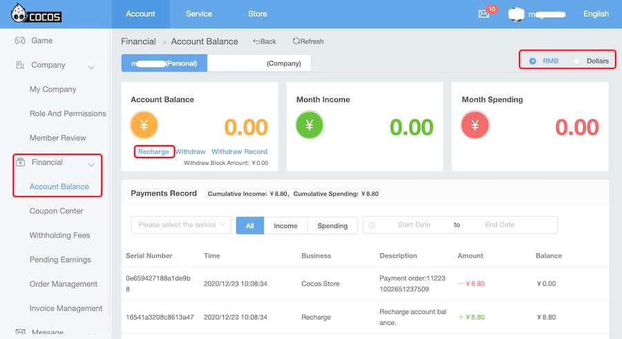

# About Billing

Cocos Service provides the following paid service in the English environment. You can click the link below to view the official pricing:

- [Agora RTC](https://docs.agora.io/en/Voice/billing_rtc?platform=All%20Platforms)

Cocos users can get discounts by enabling paid services and paying through their Cocos account. **Discount coupons** can be obtained in the console, superimposed with official discounts.

## Payment

- In the service panel of Cocos Creator, click the **Cocos Service Center** button at the top right to jump to the management background.
- On the **Account** page, click the **Financial -> Account Balance** tab in the sidebar.
- Select **Personal / Company** category, click **Recharge** button in **Account Balance**.
- Please make sure that the service-enabled game is under the **Personal** or **Company** category to avoid incorrect recharge.
- In the upper right corner, select **Dollar** (USD) or **RMB** (CNY) to recharge.

     

- Fill in the **Recharge Amount**, and then choose to recharge via **PayPal** (USD) or **Alipay/WeChat** (CNY).

## View bill

- Each user's fee can be viewed in **Financial -> Account Balance -> Payments Record** in [Cocos Account](https://account.cocos.com/) console.

- The service provider usually uses **day** as the settlement unit, and settles the service provider's side expenses on **T+1** day. Cocos usually pulls this data on **T+2** and generates bills for Cocos users. Therefore, the daily expenses deducted in the income and expenditure details are usually reflected **two days ago**.
