# Yidun (NetEase) Quick Start

[Yidun (NetEase)](https://dun.163.com/locale/en), provide developers with game package reinforcement and anti-cheat capabilities. During the development, developers integrate the SDK manually. After the build is completed, developers can reinforce the game package with just one click. Developers do not need to carry out additional development work for game security protection and can focus on the game business logic, build a game defense system with little effort. Support all platforms: Android, iOS, H5.

### Version Update Description (Cocos Creator 2.x)

- Current Version: 0.5.3_5.0.4_1.7.1.3

    -  Optimize account association process.

- 0.5.2_5.0.4_1.7.1.3

    -  Add NetEase Yidun service.

### Version Update Description (Cocos Creator 3.x)

- Current Version: 2.1.0_5.0.4_1.7.1.3

    -  Optimize account association process.

- 2.0.0_5.0.4_1.7.1.3

    -  Add NetEase Yidun service.

## Enable Yidun Service

- Use Cocos Creator to open the project that needs to integrate with the Yidun service.

- Click on **Panel -> Service** in the menu bar to open the Service panel, select Yidun service to go to the service detail page, and then click on the Enable button in the top right to enable the service. For details, please refer to the Cocos Service [Operation Guide](./index.md#usage) documentation.

- After opening the service, if your cocos account is not associated with an Yidun account, a button "associated with Yidun" will be displayed on the panel, as follows:

  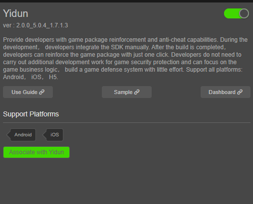
  
- Click the "Associate with Yidun" button, a dialog box will pop up to open the Yidun association page, as follows:

  
  
- After clicking "Agree and Continue", you can login/register your account as follows:

  

- If you don't have an Yidun account yet, please click the "Register for free" button and fill in the relevant information to register for an Yidun account. After registration, you will be automatically logged in; if you already have an Yidun account, please enter your existing Yidun account and password to login. After the login is complete, the following authorization page will be displayed:

  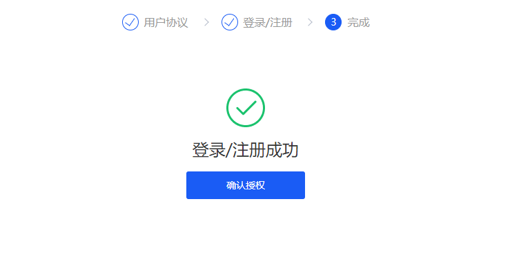
  
- Click "Confirm authorization" to complete the authorization. After authorization is completed, go back to Cocos Creator and click "Association completed" as follows:

  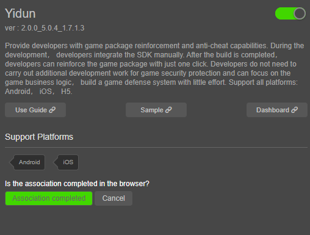
  
- After completing the association with the Yidun account, if there is no game under the account, the panel will display the page for creating a game, as follows:

  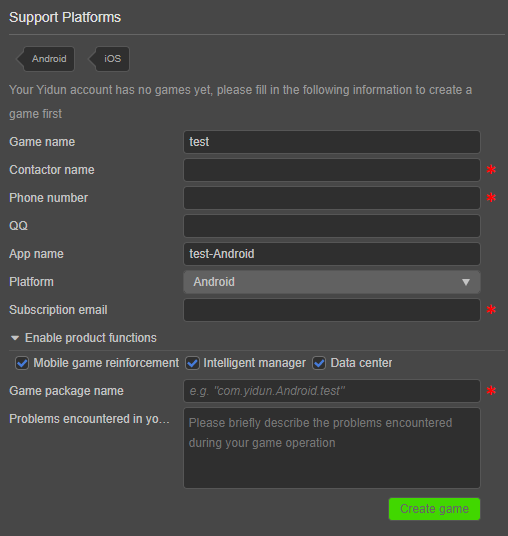

- After filling in the relevant information, click "Create game" to complete the creation of the game. After the game is created, the functional page will be displayed, as follows:

  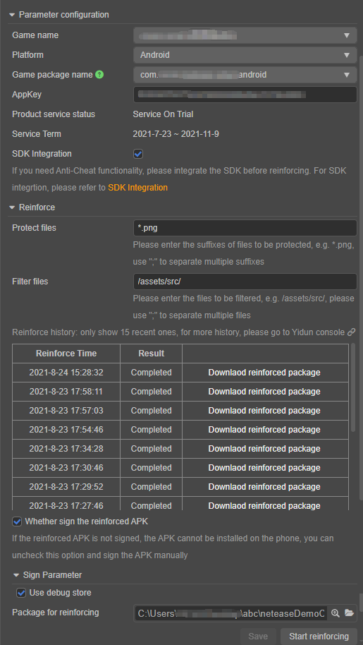
  
* <font color="red">Note 1: When building the game, remember that the package name/bundle ID need to be consistent with the App of the Yidun account.</font>

* <font color="red">Note 2: If you need to add a new package name, please contact the Yidun team.</font>

### Create Apps of other platforms (optional)

- In Yidun, Android and iOS are two separate Apps. If you need to create an App for another platform, please click the "Platform" drop-down menu and select the target platform (such as "iOS"), as follows:

  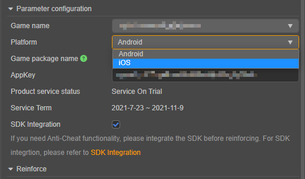
  
- After selecting, if you do not have an App for the target platform, the following create App page will be displayed:

  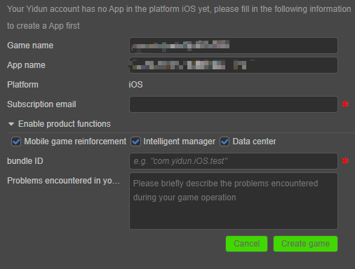

- Please fill in the relevant information, and finally click "Create game" to create an App under this platform. If you don't want to create it, you can click "Cancel" to return to the functional page.

### Verify whether the service is integrated successfully

#### Game reinforcement

After the game is compiled, you can reinforce the game.

- First of all, you need to fill in the "Protect files" and "Filter files" to inform Yidun which files need to be protected, otherwise the protection effect may decrease, as follows:

  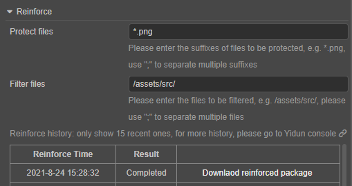
  
- Next, select the game package to be reinforced, as follows:

  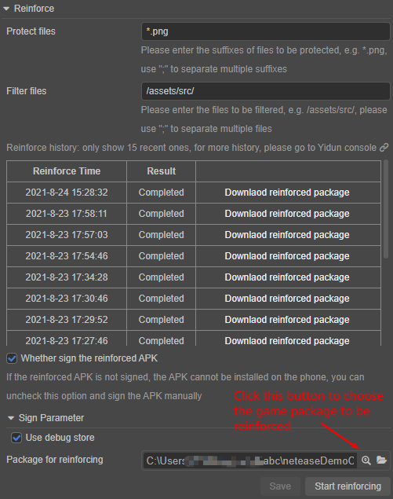

- Finally, click "Start reinforcing" to reinforce the game<font color="red">（Note: Be sure to select the correct platform in the drop-down menu, and then reinforce it. For example, the APK game package should select the App of the Android platform.）</font>.

- After clicking "Start reinforcing", the UI will display the reinforcing progress, as follows:

  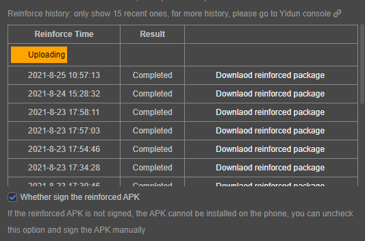
  
- After the reinforcing is successful, you will be prompted whether you want to download the reinforced game package. Choose OK to download it. You can also click the "Download reinforced package" button of a record in the reinforce history to download it.

#### Anti-Cheat SDK

If you need the Anti-Cheat function, please integrate the SDK before reinforcing.

- First, you need to check the "SDK integration" as follows:

  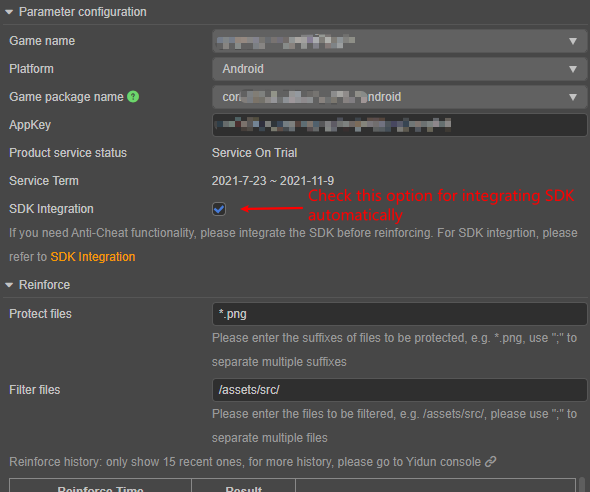

- Next, Click the "Save" button as follows：

  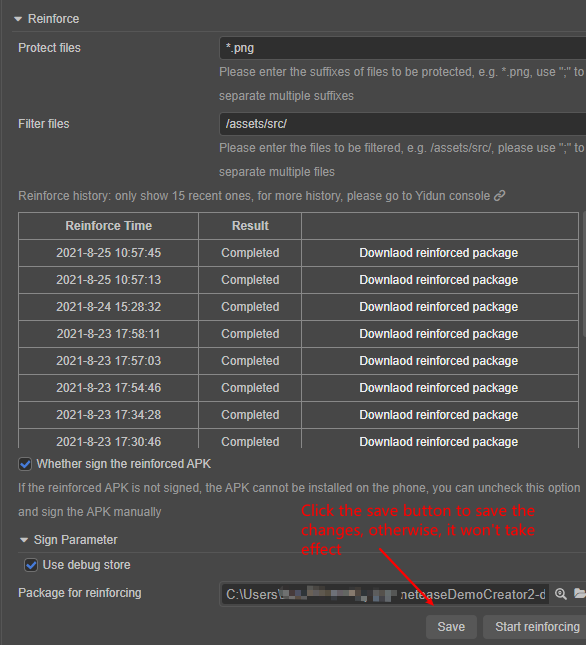
  
- Note that after checking "SDK Integration", the SDK will only be automatically integrated during the build, you also need to manually call the SDK APIs to use Anti-Cheat functions (e.g. Initialize the SDK), for more details, please refer to [SDK Integration](https://support.dun.163.com/documents/413846598587424768?docId=418198765332385792) and [Yidun - Cocos Service API documentation](https://service.cocos.com/document/api/modules/netease.html).

* <font color="red">Note: after checking "SDK Integration", the SDK will only be integrated on current platform, if you need the SDK to be integrated on other platforms, please switch to other platforms and check the "SDK Integration".</font>

- After completing the above steps, we can verify whether the SDK integration is successful by adding a simple code to the script as follows:

```ts
// Initialize the SDK
netease.yidun.yidunService.init();
// The default server area type is Chinese Mainland, if the area of your App is not Chinese Mainland,
// you need to pass an argument to tell SDK the server area type as follows:
// netease.yidun.yidunService.init(netease.yidun.ServerType.Other);
// For other SDK APIs, please refer to the documentation or the sample project.
```
- After the project runs on the mobile phone, first confirming that there is no prompt such as "appId is incorrect", then go to the "Statistical Analysis" page under the "Smart Anti-Cheat" section of the Yidun console to check whether the number of users has increased.

## Sample Project

Developers can get a quick experience of the Yidun service with the sample project.

- Click on the **Sample** button in the Yidun Service panel, clone or download the sample, and then open the project in Cocos Creator.

- After enabling the Yidun service and take the steps as described above, open the menu **Project -> Build** to build the project.

- Once the Sample project is running on the phone, click the various buttons to test the functionality.

  

  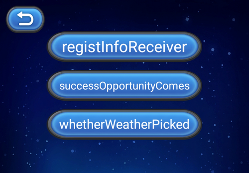

## Developer Guide

Please refer to the sample project for the complete code.

### Initialize the SDK

First of all, in order to enable the Anti-Cheat functions, we need to initialize the SDK. The code is as follows:

```ts
netease.yidun.yidunService.init();
```

By default, the server area type is Chinese Mainland, if the area of your App is not Chinese Mainland, you can pass the server area type to `init` as follows:

```ts
netease.yidun.yidunService.init(netease.yidun.ServerType.Other);
```

On iOS, if you need the transparent transmission function, you need to pass the address of the transparent transmission server to `init` as follows:

```ts
netease.yidun.yidunService.init(netease.yidun.ServerType.ChineseMainland, 'https://www.netease163.com');
```

Most of the Anti-Cheat functions of the SDK run automatically and do not need to call additional APIs, but some APIs still need to be called manually (e.g. `setRoleInfo` API). For more details, please refer to the following examples, [SDK Integration](https://support.dun.163.com/documents/413846598587424768?docId=418198765332385792) and [Yidun - Cocos Service API documentation](https://service.cocos.com/document/api/modules/netease.html).

### Login API/Set role information

The SDK needs to know the current player's character ID, character name, etc to associate the current cheating behavior with the specific character and give corresponding punishments. You need to call the `setRoleInfo` API to set the role information. The sample code is as follows:

```ts
const roleId = '123456';
const roleName = '易小盾';
const roleAccount = 'yd@163.com';
const roleServer = '游戏测试服';
const serverId = 123; // Only used on Android
const gameJson = {
  GameVersion: '1.0.1',
  AssetVersion: '1.0.1',
  TransHost: 'test.163.com',
  TransIP: '8.8.8.8',
  TransPort: 80,
};
netease.yidun.yidunService.setRoleInfo(
  roleId,
  roleName,
  roleAccount,
  roleServer,
  serverId,
  JSON.stringify(gameJson)
);
cc.log('setRoleInfo');
cc.log('roleId:' + roleId);
cc.log('roleName:' + roleName);
cc.log('roleAccount:' + roleAccount);
cc.log('roleServer:' + roleServer);
cc.log('serverId:' + serverId);
cc.log('gameJson:' + JSON.stringify(gameJson));
```

### General query

`ioctlAndroid` and `ioctlIos` provide general query functions under Android and iOS, such as query root, simulator, version number and other customized functions. Because of the different query and functions supported under Android and iOS, they are divided into two interfaces. Please call different interfaces according to the specific platform.

The sample code of `ioctlAndroid` is as follows:

```ts
let requestCmdId = netease.yidun.RequestCmdIdAndroid.GetEmulatorName;
cc.log('The name of the emulator:', netease.yidun.yidunService.ioctlAndroid(requestCmdId, ''));

requestCmdId = netease.yidun.RequestCmdIdAndroid.IsRootDevice;
cc.log('Is root device:' + netease.yidun.yidunService.ioctlAndroid(requestCmdId, ''));

requestCmdId = netease.yidun.RequestCmdIdIos.QuerySDKVersion;
cc.log('SDK Version:' + netease.yidun.yidunService.ioctlIos(requestCmdId, ''));
```

The sample code of `ioctlIos` is as follows:

```ts
let requestCmdId = netease.yidun.RequestCmdIdIos.QueryRootStatus;
cc.log('Root status:' + netease.yidun.yidunService.ioctlIos(requestCmdId, ''));

requestCmdId = netease.yidun.RequestCmdIdIos.QuerySDKVersion;
cc.log('SDK Version:' + netease.yidun.yidunService.ioctlIos(requestCmdId, ''));

requestCmdId = netease.yidun.RequestCmdIdIos.QueryYiDunCode;
cc.log('Yidun Code:' + netease.yidun.yidunService.ioctlIos(requestCmdId, ''));
```

### Other APIs

For the use of other APIs, please refer to the documentation and the sample project.

## API Documentation

For detail explanation of APIs, please refer to [SDK Integration](https://support.dun.163.com/documents/413846598587424768?docId=418198765332385792) and [Yidun - Cocos Service API documentation](https://service.cocos.com/document/api/modules/netease.html).

## Notes for iOS platform

If the target platform you are building is iOS and the "SDK integration" is checked, after the build is completed, do not click compile directly, you need to open the generated Xcode project with Xcode, and continue to compile the project in Xcode, otherwise the compilation will fail (This is because when you click compile in Cocos Creator, the architecture of the simulator will be compiled by default, generally, this is the x86\_64 architecture, and the Yidun SDK does not support the x86\_64 architecture right now).

For Cocos Creator 3.x, the path of the generated Xcode project typically will be {your-project-directory}/build/jsb-link/frameworks/runtime-src/proj.ios_mac/{game-name}.xcodeproj.

For Cocos Creator 3.x, the path of the generated Xcode project typically will be {your-project-directory}/build/{build-task-name}/proj/{game-name}.xcodeproj.

### The problem about iOS game reinforcement need to enable bitcode and SDK integration need to disable bitcode

If the target platform you are building is iOS, you need to pay attention: SDK integration needs to disable the bitcode build option (disabled by default), and the iOS game reinforcement needs to enable the bitcode build option (need to be turned on in Xcode). These are conflicting requirements, and currently Cocos Creator does not support enabling bitcode for compiling right now, the compilation will fail (some third party libraries do not include bitcode when compiled), so the reinforcement of iOS games is not currently supported, but the functions of the SDK can be used normally.
