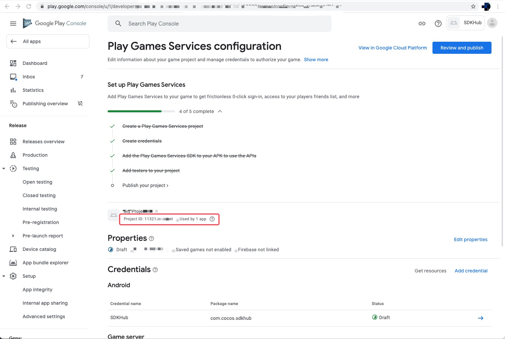

# Google Play plugin usage guide

Currently, the Google Play plugin provided by Cocos SDKHub includes [Game Services](https://developers.google.com/games/services/console/enabling), [In-App Payment Service](https://developer.android. com/google/play/billing), and some [Account services](https://developers.google.com/games/services/android/signin), developers need to call the Cocos SDKHub interface at the JS layer to handle callbacks.

**Account & Game Service** and **Payment Service** in the plug-in can be used independently.

The Cocos SDKHub framework and plug-ins basically do not involve current state processing and server-side interfaces, such as whether the current user is logged in, etc., the game side needs to judge to avoid crashes caused by calling accounts and other game service interfaces when the user is not logged in. In order to perform payment verification operations on Google Play, developers need to verify the validity of the payment and decide whether to make a purchase after the successful callback call.

| Google Play SDK name | Current version number | Description |
| :--- | :--- | :--- |
| com.google.android.gms:play-services-auth | 19.0.0 | Account service |
| com.google.android.gms:play-services-games | 21.0.0 | Game Services |
| com.android.billingclient:billing | 4.0.0 | In-App Payment Service |


## 准备工作

- Refer to the [Google Play Services](https://developers.google.cn/android/guides/setup) document, configure according to the document, and finally get the parameters from the figure and fill in the service panel.

     

- If you need to use the payment service, please refer to the payment document to perform the corresponding configuration in the Google Play background
    
- It needs to be tested on a mobile phone that has installed Google Mobile Services, preferably an Android native mobile phone.

## Sample Project

Developers can quickly experience Cocos SDKHub through the Sample project. If developers need to access Google Play in their game projects, they can also refer to this process. Please make sure that the [prep work](#prep work) part has been completed and the required parameters have been obtained.

## Development Guide

Please refer to [Cocos SDKHub-Development Guide](../sdkhub.md/#Development Guide) when developing. This chapter serves as a supplementary description of Google Play plug-in features.


### Account and game plugins

Please refer to [Cocos SDKHub-account and game plugin](../sdkhub.md/#account and game plugin) when developing. This chapter serves as a supplementary description of Google Play plugin features.

Whether the current user is logged in or not, the game terminal needs to be judged to avoid crashes caused by calling the account and other interfaces of the game service when the user is not logged in.

#### Achievements

**Show Achievements**

**Parameter Description**:

| Parameter name | Fill in format | Description |
| :--- | :--- | :--- |
| achievement_id | "5D9580837D32CB59Cxxx" | Achievement ID generated after background configuration |

**Example**：

```js
var params = {
    "achievement_id": "5D9580837D32CB59Cxxx"
};
sdkhub.getUserPlugin().showAchievements(params);
```

**Unlock achievements**

**Parameter Description**:

| Parameter name | Fill in format | Description |
| :--- | :--- | :--- |
| achievement_id | "5D9580837D32CB59Cxxx" | Achievement ID generated after background configuration |
| numSteps | "50" | The step length of the current achievement (optional, only needed if the configured achievement is a phased achievement, otherwise don't pass it)|

**Example**：

```js
var params = {
    "achievementId": "5D9580837D32CB59Cxxx",
    "numSteps": "50"
};
sdkhub.getUserPlugin().unlockAchievement(params);
```

#### Ranking

**Show leaderboard**

**Parameter Description**:
Optional parameter value meaning reference https://developers.google.com/android/reference/com/google/android/gms/games/LeaderboardsClient#parameters_2
| Parameter name | Fill in format | Description |
| :--- | :--- | :--- |
| leaderboard_id | "5D9580837D32CB59Cxxx" | Leaderboard ID automatically generated after background configuration|
| timeSpan | "1" | Optionally, the time span for retrieving data. Valid values are '0', '1', '2' |
| collection | "0" | Optional, the collection displayed by default. Valid values are '0', '3' |

**Example**：

```js
var params = {
    "leaderboard_id": "5D9580837D32CB59Cxxx",
};
sdkhub.getUserPlugin().showLeaderBoard(params);
```

**Submit Score**

**Parameter Description**:

| Parameter name | Fill in format | Description |
| :--- | :--- | :--- |
| leaderboard_id | "5D9580837D32CB59Cxxx" | Leaderboard ID automatically generated after background configuration |
| score | "10000" | The score to be submitted to the leaderboard, the Java side is a `long` type. |
| scoreTag | "ssss" | Optional, optional metadata about this score. No more than 64 URI safe characters  |

**Example**：

```js
var params = {
    "leaderboard_id": conf.google.leaderboardId,
    "score": "6000",
};
sdkhub.getUserPlugin().submitScore(params);
```


---

**The following methods need to pass [Extension Method Call](../sdkhub.md/#Extension Method Call)**.

#### Logout

Revoke the access permissions granted to the current application.

**Method name**: `revoke`

**Parameter description**: No parameters are required.

**Example**：

```js
sdkhub.getUserPlugin().callFuncWithParam("revoke");
```


**Callback description**:

| Extended callback value | msg type | msg description |
| :--- | :--- | :--- |
| 29 | number | Logout successful |
| 30 | number | Logout failed |
| 31 | number | The current user is not logged in |
| 32 | number | Missing parameter |
| 33 | number | Go back to current user callback |


### Payment plugin

Please refer to [Cocos SDKHub-payment plugin](../sdkhub.md/#payment plugin) when developing. This chapter serves as a supplementary description of the Google Play plugin features.

#### Pay for goods

`feeForProduct`

**Parameter Description**:

| Parameter name | Fill in format | Description |
| :--- | :--- | :--- |
| Product_ID | "CProduct1" | Product ID of the background configuration product |
| Sku_Type | "inapp" | inapp corresponds to consumable products, subs corresponds to subscription products |
| Order_Id | "Order_Id" | Order ID on development |
| Account_Id | "Account_Id" | Specify an optional obfuscated string that is uniquely associated with a user account in your application. |
| Role_Id | "Role_Id" | Specify an optional obfuscated string that is uniquely associated with the user profile in your application. |

---

**The following methods need to pass [Extension Method Invocation](../sdkhub.md/#Extension Method Invocation). **

#### Determine whether to support in-app payment

Determine whether the in-app payment method is supported. Before using in-app payment, the developer’s application needs to ask whether payment is allowed

**Method name**: `isEnvReady`

**Parameter description**: No parameters are required.

**Example**:

```js
sdkhub.getFeePlugin().callFuncWithParam("isEnvReady");
```

**Consumption of goods**

**Method name**: `consume`

**Parameter Description**:

**Parameter Description**:

| Parameter name | Fill in format | Description |
| :--- | :--- | :--- |
| purchaseToken | "purchaseToken" | After the payment is completed, obtain the JSON string returned by the callback of the successful payment |
| skuType | "skuType" | inapp corresponds to consumable products, subs corresponds to subscription products |

**Example**：

```js
let ret = JSON.parse(msg)
sdkhub.getFeePlugin().callFuncWithParam("consume", {
  purchaseToken: ret.purchaseToken,
  skuType: conf.google.skuType
});
```

**Callback description**:

| Extended callback value | msg type | msg description |
| :--- | :--- | :--- |
| 9 | String | Consumables successfully consumed |
| 10 | String | Subscription product consumption success |
| 11 | String | Parameter operation |
| 12 | String | Payment environment preparation callback |
