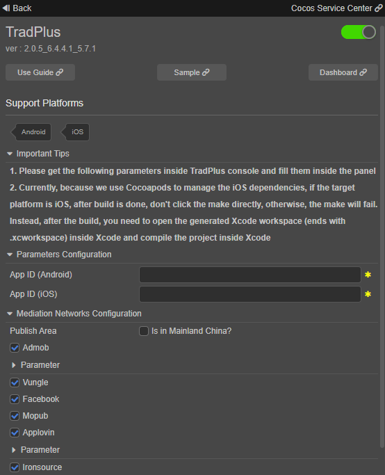

# TradPlus(Ads Mediation) Quick Start

**（注意：更新标语，以及各个截图等）**

[TradPlus Ads Mediation](https://www.tradplusad.com/?lan=en)，具有100%数据透明、全球广告资源、广告漏斗模型、智能优化算法、30 min快捷接入的产品优势，同时提供变现方案、数据分析、技术支持、托管服务、平台开户等服务。多达38种数据埋点，为您提供完整的变现“体检报告”，透视广告变现各个环节的流失率，实现精细化运营。协助开发者构建BI系统，形成数据运营闭环。为开发者提供收益最大化的广告变现解决方案，做开发者最专业的广告变现合作伙伴。

### Version Update Description

- Current Version: 2.0.1_6.4.4.1_5.7.1

    -  Add TradPlus Ads Mediation Platform.

## Enable TradPlus Service

- Use Cocos Creator to open the project that needs to integrate with the TradPlus service.

- Click on **Panel -> Service** in the menu bar to open the Service panel, select TradPlus service to go to the service detail page, and then click on the Enable button in the top right to enable the service. For details, please refer to the Cocos Service [Operation Guide](./index.md#usage) documentation.

  

- If you don't have an account of TradPlus Ads Mediation Platform, please go to [TradPlus](https://developer.tradplusad.com/) to register. Then, following the [Guide](https://docs.tradplusad.com/en/docs/Guide/) for the corresponding configuration and get the `App ID` and other parameters that are needed by Cocos Service.

* <font color="red">NOTE: TradPlus Ads Mediation need you to create different App IDs on iOS and Android, they can't share the same App ID.</font>

### Verify whether the service is integrated successfully

- Once the **TradPlus** service is integrated, we can verify whether the integration is successful or not by adding the following simple code inside our script.

```ts
// Enable debug log, this is for testing only, please comment it out before publish.
tradplus.tradPlusService.setEnableLog(true);
// Initialize the SDK.
tradplus.tradPlusService.initSdk();
// Enable test mode, this is for testing only, please comment it out before publish.
tradplus.tradPlusService.setNeedTestDevice(true);
```

- Run the project on a phone. For Android, view the log inside Android Studio, filter the log by keyword 'TradPlusLog'. For iOS, view the log inside Xcode, filter the log by keyword 'TradPlus'.

## Sample Project

Developers can get a quick experience of the TradPlus service with the sample project.

- Click on the **Sample** button in the TradPlus Service panel, clone or download the sample, and then open the project in Cocos Creator.

- After enabling the TradPlus service and fill the parameters as described above, open the menu **Project -> Build** to build the project.

- Once the Sample project is running on the phone, click the various buttons to test the functionality.

  

## Developer Guide

Please refer to the Sample project for the complete code.

### Initialize the SDK

First, we need to initialize the SDK, we can only call Ad-related APIs after the initialization.

The code to initialize the SDK:

```ts
// Initialize the SDK, we don't need to pass a App ID as parameter, it will use the App ID you filled in the Service panel.
tradplus.tradPlusService.initSdk();
```

During development, if you need to view the debug log, you can call `setEnableLog`. If you need to enable test mode, you can call `setNeedTestDevice`.

So, a typical initialize code during development is the following:

```ts
// Enable debug log, this is for testing only, please comment it out before publish.
tradplus.tradPlusService.setEnableLog(true);
// Initialize the SDK.
tradplus.tradPlusService.initSdk();
// Enable test mode, this is for testing only, please comment it out before publish.
tradplus.tradPlusService.setNeedTestDevice(true);
```

**NOTE: `setEnableLog` and `setNeedTestDevice` are for testing only, please comment it out before publish.**

### Banner Ad

The steps to use Banner Ad are as follows:

1. Pass the adUnitId to `getBanner` to get the corresponding Banner object of the adUnitId.

2. Call `banner.setAdListener` to set event listener of the Banner object, so we can take corresponding actions when an event happened.

3. Call `banner.loadAd` to load and display Banner Ad.

Complete code:

```ts
const adUnitId = 'Your adUnitId';

const banner = tradplus.tradPlusService.getBanner(adUnitId);

banner.setAdListener({
  onAdLoaded: (adSourceName) => {
    // Triggered on Ad loaded, adSourceName is the name of Ad source platform.
  },

  onAdClicked: () => {
    // Triggered on Ad clicked.
  },

  onAdLoadFailed: (adError) => {
    // Triggered on Ad load failed, adError contains error information.
  },

  onAdImpression: () => {
    // Triggered on Ad shown.
  },

  onAdShowFailed: (adError) => {
    // Triggered on Ad show failed, adError contains error information.
    // NOTE: This callback will only triggered on Android.
  },

  onAdClosed: () => {
    // Triggered on Ad closed.
    // NOTE: This callback will only triggered on Android.
  },

  onBannerRefreshed: () => {
    // Triggered on Ad refreshed.
    // NOTE: This callback will only triggered on Android.
  },
});

// Load and show the Banner Ad at the top of the screen.
this.banner.loadAd('top');
```

### Rewarded Video and Interstitial Ad

The usage of Rewarded Video and Interstitial Ad are similar to Banner Ad, please refer to the Sample project and [TradPlus - API Documentation](https://service.cocos.com/document/api/modules/tradplus.html).

### SDK Privacy

SDK Privacy involve GDPR, CCPA and COPPA, you can refer to the TradPlus offical documentation: [SDK Privacy (Android)](https://docs.tradplusad.com/en/docs/tradplussdk_android_doc_v6/ios_sdk_privacy) or [SDK Privacy (iOS)](https://docs.tradplusad.com/en/docs/integration_ios/ios_sdk_privacy/ios_sdk_privacy).

#### GDPR

If your application need to publish to EU, then you need to pay special attention to GDPR.

For setting GDPR, we need the following steps:

1. Set a GDPR listener before you initialize the SDK.

2. In the onSuccess callback of the GDPR listener, determine whether GDPR is applicable, if applicable, call the API to show the GDPR dialog for the user to choose a GDPR level.

The following is the complete initialize code:

```ts
// Enable debug log, this is for testing only, please comment it out before publish.
tradplus.tradPlusService.setEnableLog(true);

// Set GDPR listener, need to be called before you initialize the SDK.
tradplus.privacy.setGDPRListener({
  onSuccess: () => {
    // Known country.
    if (tradplus.privacy.isGDPRApplicable()) {
      // GDPR is applicable, show the GDPR dialog for the user to choose a GDPR level.
      this.console.log('GDPR is applicable');
      this.showGDPR();
    } else {
      this.console.log('GDPR is not applicable');
    }
  },
  onFailed: () => {
    // Unknown country, let the user choose the GDPR level.
    this.console.log(
      'Unknown country, let the user choose the GDPR level'
    );
    this.showGDPR();
  },
});

// Initialize the SDK.
tradplus.tradPlusService.initSdk();

// Enable test mode, this is for testing only, please comment it out before publish.
tradplus.tradPlusService.setNeedTestDevice(true);
```

#### CCPA

If you need to set CCPA, please call the API `setCCPADoNotSell`, false: California users do not report data, true: Accept to report data.

NOTE: `setCCPADoNotSell` need to be called before you initialize the SDK.

```ts
tradplus.privacy.setCCPADoNotSell(false /* or true */);
```

#### COPPA

If you need to set COPPA, please call the API `setCOPPAIsAgeRestrictedUser`, false: Indicate that it is not a child, true: Indicate that it is a child.

NOTE: `setCOPPAIsAgeRestrictedUser` need to be called before you initialize the SDK.

```ts
tradplus.privacy.setCOPPAIsAgeRestrictedUser(true /* or false */);
```

## API Documentation

For detail explanation of API, please refer to [TradPlus - API Documentation](https://service.cocos.com/document/api/modules/tradplus.html).

## NOTES

### Build for iOS platform

Currently, because we use Cocoapods to manage the iOS dependencies, if the target platform is iOS, after build is done, don't click the make directly, otherwise, the make will fail. Instead, after the build, you need to open the generated Xcode workspace (ends with .xcworkspace) inside Xcode and compile the project inside Xcode.

For Cocos Creator 3.x, the path of the generated Xcode workspace typically will be {your-project-directory}/build/{build-task-name}/proj/{game-name}.xcworkspace.

### iOS 14+

Apple will implement a new rule in 2021 to obtain IDFA through a pop-up window on iOS 14+. The user's consent is required to use IDFA.

If you need to adapt for iOS 14+, please check the "Adapt to iOS 14+" and fill the parameters, NOTE: this need you to upgrade your Xcode to a version that >= 12.
