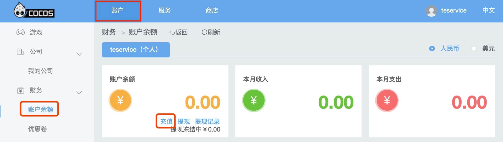
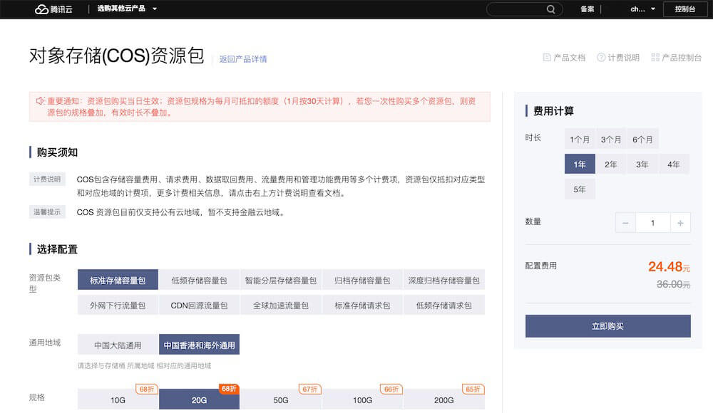
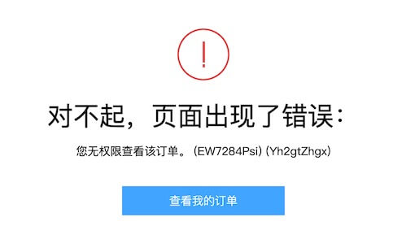
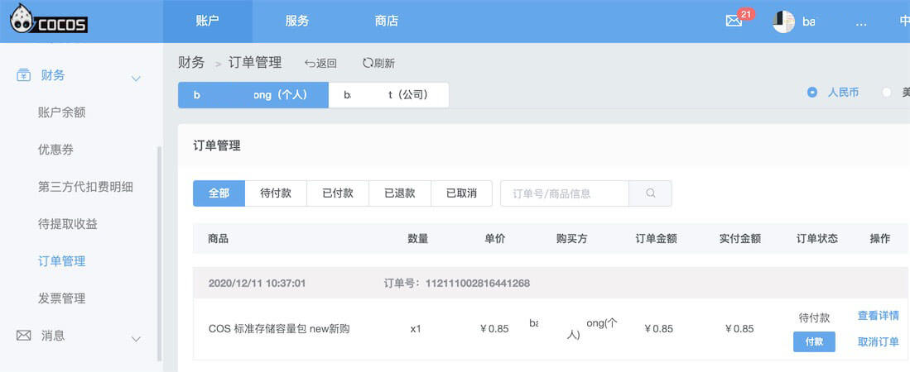
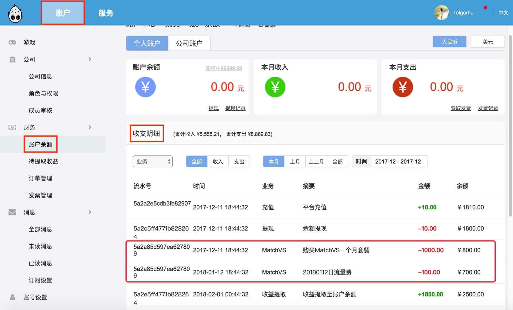

# 计费说明

Cocos Service 当前提供以下付费服务。可点击下方链接，查看各服务的官方定价：

- [Agora RTC](https://docs.agora.io/cn/Voice/billing_rtc?platform=All%20Platforms)
- [腾讯云 TCB 云开发](https://cloud.tencent.com/document/product/876/18864)
- [腾讯云 MGOBE 游戏联机对战引擎](https://cloud.tencent.com/document/product/1038/33293)
- [腾讯云 GME 游戏多媒体引擎](https://cloud.tencent.com/document/product/607/38500)

Cocos 用户开通付费服务，并通过 Cocos 账户充值或购买套餐，即可享受优惠政策。

## 计费方式

### 按量计费

按量计费，也称后计费，即先按需申请资源使用，在结算时会按您的实际资源使用量收取费用。按量计费根据资源的结算周期进行结算，在达到结算周期时，生成账单，执行扣款。

当开发者的服务使用超过服务商的免费部分，且账户余额不足时，会导致 **服务停止**。所以在使用该类服务时，请务必确保账户余额充足。可以前往 [Cocos 开发者账户中心](https://account.cocos.com/) 进行 **预充值**。

若开发者的游戏同时使用了多个付费服务，可以统一在 Cocos 平台结算，无需在多个后台分别充值和管理费用。Cocos 平台的账户余额可以随时提取，也为开发者在使用第三方服务时提供了安全保障。

#### 适用场景

按量计费是按照使用多少付多少。如果有如下特征，可选择使用按量计费。

- 业务发展有较大波动性，且无法进行准确预测。
- 资源使用有临时性和突发性。

**优点**

- 可以先使用后付款，相对预付费更灵活，用多少付多少，计费准确，无资源浪费。
- 可以按需紧急增加或者缩小资源，快速根据业务需要调整资源的购买需求。

**缺点**

- 单位价格较预付费高。
- 较大量资源临时增加时可能出现无资源可用情况。

### 购买套餐

用户根据自身对服务的使用需求，一次性支付一个月、多个月或多年的费用，支付成功后，服务资源将被系统分配给用户使用，直到到期后用户未继续续费而被回收。

目前腾讯云各服务支持套餐购买方式，请参考 [腾讯云套餐购买方式](#腾讯云套餐购买方式)。

#### 适用场景

当用户具有如下特征时，推荐进行预付费购买。

- 具有较稳定的业务场景。
- 需要长期使用服务资源，追求低成本。

**优点**

- 单价较按需付费低。
- 长期锁定资源，避免无资源可用的情况。

**缺点**

- 不可随意退还资源。
- 资源的升降配置一般也会受限。

## 充值方式

- 在服务的设置面板中点击右上方的 **前往 Cocos 服务中心** 按钮，跳转到管理后台。
- 切换到 **账户** 页面，点击侧边栏中的 **账户余额** 标签。
- 选择 **个人 / 公司** 类别，点击 **账户余额** 中的 **充值** 按钮。
- 确认开通服务的游戏在 **个人** 类别还是在 **公司** 类别下，以免错误充值。

    

- 填入 **充值金额**，然后选择通过 **支付宝** 或 **微信** 平台充值。

## 腾讯云套餐购买方式

由于用户在 Service 面板中开通的腾讯云账号类型为子账号，所以无法直接在腾讯云后台购买腾讯云相关的资源包套餐（TCB/MGOBE/GME），因此我们提供了一套简易流程方便用户自助购买套餐。

1. 在腾讯云后台登录账号，选择要购买的套餐。

    
    
    待页面弹出报错信息：“您无权限查看该订单”：

    

2. 然后登录 **Cocos 开发者账户中心**，在 **财务 -> 订单管理 -> 待付款** 中查看待支付订单，确认并支付后即可开通套餐。

    

    若未找到待支付订单，请等待一分钟或者多刷新一下页面。

## 查看账单

- 用户的每一笔扣费，在 [Cocos 开发者账户中心](https://account.cocos.com/) 的 **财务 -> 账户余额 -> 收支明细** 中可以查看到：

    

- 按量计费情况下，服务商通常以 **天** 为结算单位，在 **T+1** 日结算服务商侧的费用。而 Cocos 通常在 **T+2** 日拉取该数据，并对 Cocos 用户生成账单。所以收支明细中扣除的日结费用，通常为 **两天前** 的费用体现。
