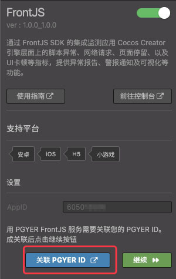
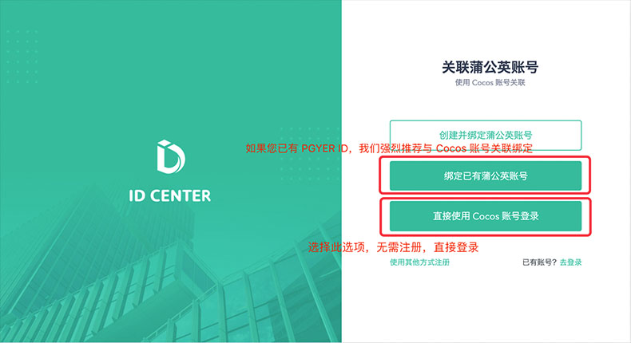
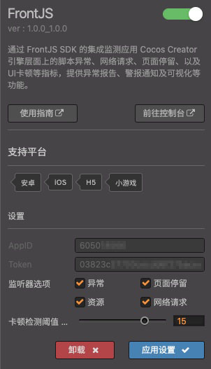
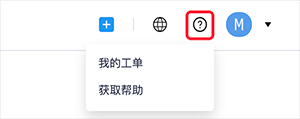

# FrontJS 快速入门

[FrontJS](https://www.frontjs.com/game) 由 [蒲公英](https://www.pgyer.com/)（西安点测网络科技有限公司）开发而成。FrontJS 游戏性能监控平台是实时监控并分析游戏性能和故障的云服务， 帮助游戏开发者快速定位和分析问题所在，改善用户体验，提升业务转化，减少用户流失。

通过 FrontJS 的集成，可以监控应用 Cocos Creator 引擎层面上的脚本异常、网络请求、页面停留、以及 UI 卡顿等指标，提供异常报告、警告通知及可视化等功能。

可参考 [Demo](https://www.frontjs.com/demo/) 了解 FrontJS 产品功能和后台使用。Creator 的监控后台以及提供的功能，和 **小程序** 版基本一致，多了卡顿监测的功能。

### 产品特性

- **快速接入**：下载 SDK 集成接入，轻松开始游戏监控。
- **超高性能**：支持海量业务吞吐，无惧迅猛流量。
- **自动监测**：自动监测游戏过程中的卡顿等异常情况。
- **智能分析**：自动帮您分析各种异常，定位问题所在。

### 产品功能

- **全方位呈现问题**：从脚本异常、网络请求、场景停留、UI 卡顿等全方位实现游戏性能可视化，轻松直观了解当前游戏运行状况，以便做出及时应对。

- **主动发现并解决问题**：通过平台主动发现问题，由之前的被动投诉转变为主动发现并解决问题，提高效率，提升体验。

- **发掘深层核心问题**：透视传统监控工具无法触及到的业务质量问题，通过发现和定位深层次问题，解决开发者核心痛点。

### 版本更新说明

- 当前版本：1.0.1_1.0.1

    - 新增 FrontJS 插件。

## 一键接入 FrontJS 服务

### 开通服务

- 使用 Cocos Creator 打开需要接入 FrontJS 服务的项目工程。

- 点击菜单栏的 **面板 -> 服务**，打开 **服务** 面板，选择 **FrontJS**，进入服务详情页。然后点击右上方的 **启用** 按钮即可开通服务。详情可参考 [服务面板操作指南](./user-guide.md)。

    

- 若需继续使用服务，还需要关联 PGYER ID，点击 关联 PGYER ID 按钮按照提示即可完成关联流程。如果您已有蒲公英账号，我们强烈推荐您将 Cocos 账号与 PGYER ID 绑定。若没有蒲公英账号也可点击 **直接使用 Cocos 账号登录**。完成关联后，点击 **继续** 按钮后即可安装 SDK。

    

- 如果你需要修改设置，可以在设置修改完成后点击 **应用设置** 按钮，此面板的设置会和 FrontJS 控制台面板设置同步。

    

- 设置完成后，将游戏发布到各对应平台后即可使用。如果要发布到小游戏平台，需要将 `https://collecter.frontjs.com` 设置为合法域名。

### 验证服务是否接入成功

FrontJS 服务接入完成后，无需代码接入，当接入游戏运行后 3 分钟左右，即可在后台看到数据。

FrontJS 也提供了一个 [简单 Demo](https://static.frontjs.com/dist/sdk/cocos-20200226.zip)，可接入服务后，点击首页上方的各种事件按钮进行测试。

## 技术支持

使用 FrontJS 过程中若遇到问题，可以通过 [工单系统](https://kf.pgyer.com/app) 咨询，可在 FrontJS 后台的右上角点击按钮进入。

或者通过二维码加入微信群获得技术帮助。

## 相关参考链接

- [FrontJS 游戏监控分析平台](https://www.frontjs.com/game)
- [Cocos 游戏监控相关文档](https://seed.pgyer.com/site/TEPXmSChdD)
- [FrontJS 常见问题](https://seed.pgyer.com/site/JrBPVc6KjW)