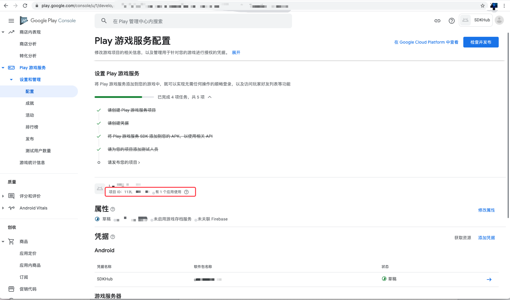

# Google Play 插件使用指南

目前 Cocos SDKHub 提供的 Google Play 插件，包括了 [游戏服务](https://developers.google.com/games/services/console/enabling)、[应用内支付服务](https://developer.android.com/google/play/billing)、和部分 [账号服务](https://developers.google.com/games/services/android/signin)，开发者需在 JS 层调用 Cocos SDKHub 接口，处理回调。

插件中的 **账号 & 游戏服务**、**支付服务** 可以独立使用。

Cocos SDKHub 框架和插件基本不涉及当前状态处理和服务端接口，例如当前用户是否登录等情况，需要游戏端进行判断，避免在用户未登录下，调用账号和游戏服务其他接口导致崩溃。Google Play 为做支付验证操作，需要开发在支付成功的回调用自行验证支付的有效性并决定是否进行消费。

| Google Play SDK 名称 | 当前版本号 | 说明 |
| :--- | :--- | :--- |
| com.google.android.gms:play-services-auth | 19.0.0 | 帐号服务 |
| com.google.android.gms:play-services-games | 21.0.0 | 游戏服务 |
| com.android.billingclient:billing | 4.0.0 | 应用内支付服务 |


## 准备工作

- 参考 [Google Play Services](https://developers.google.cn/android/guides/setup) 文档，根据文档配置，最后从图中获取参数填写到服务面板中。

     

- 若需要使用支付服务，请参考支付文档在 Google Play 后台进行相应的配置

- 需要在已安装 Google Mobile Services 的手机上进行测试，最好使用 Android 原生手机。

## Sample 工程

开发者可以通过 Sample 工程快速体验 Cocos SDKHub。若开发者需要在自己的游戏工程中接入 Google Play，也可参考此流程。请先确保 [准备工作](#准备工作) 部分已经完成，并且已获取到所需参数。

## 开发指南

开发时请先参考 [Cocos SDKHub - 开发指南](../sdkhub.md/#开发指南)，本章节作为 Google Play 插件特性的补充说明部分。


### 账号与游戏插件

开发时请先参考 [Cocos SDKHub - 账号与游戏插件](../sdkhub.md/#账号与游戏插件)，本章节作为 Google Play 插件特性的补充说明部分。

当前用户是否登录等情况，需要游戏端进行判断，避免在用户未登录下，调用账号和游戏服务其他接口导致崩溃。

#### 成就

**展示成就**

**参数说明**：

| 参数名 | 填写格式 | 说明 |
| :--- | :--- | :--- |
| achievement_id | "5D9580837D32CB59Cxxx" | 后台配置后生成的成就 ID |

**示例**：

```js
var params = {
    "achievement_id": "5D9580837D32CB59Cxxx"
};
sdkhub.getUserPlugin().showAchievements(params);
```

**解锁成就**

**参数说明**：

| 参数名 | 填写格式 | 说明 |
| :--- | :--- | :--- |
| achievement_id | "5D9580837D32CB59Cxxx" | 后台配置后生成的成就 ID |
| numSteps | "50" | 当前成就的步长（可选，若配置的成就是阶段性的成就才需要，否则不要传）|

**示例**：

```js
var params = {
    "achievementId": "5D9580837D32CB59Cxxx",
    "numSteps": "50"
};
sdkhub.getUserPlugin().unlockAchievement(params);
```

#### 排行榜

**显示排行榜**

**参数说明**：
可选参数值意义参考 https://developers.google.com/android/reference/com/google/android/gms/games/LeaderboardsClient#parameters_2
| 参数名 | 填写格式 | 说明 |
| :--- | :--- | :--- |
| leaderboard_id | "5D9580837D32CB59Cxxx" | 后台配置后自动生成的 排行榜 ID |
| timeSpan | "1" | 可选，检索数据的时间跨度。 有效值为 '0', '1', '2' |
| collection | "0" | 可选，默认显示的集合。 有效值为 '0', '3' |

**示例**：

```js
var params = {
    "leaderboard_id": "5D9580837D32CB59Cxxx",
};
sdkhub.getUserPlugin().showLeaderBoard(params);
```

**提交分数**

**参数说明**：

| 参数名 | 填写格式 | 说明 |
| :--- | :--- | :--- |
| leaderboard_id | "5D9580837D32CB59Cxxx" | 后台配置后生成的排行榜 ID |
| score | "10000" | 要提交到排行榜的分数，Java 侧为 `long` 型。|
| scoreTag | "ssss" | 可选，关于此分数的可选元数据。不超过 64 个 URI 安全字符  |

**示例**：

```js
var params = {
    "leaderboard_id": conf.google.leaderboardId,
    "score": "6000",
};
sdkhub.getUserPlugin().submitScore(params);
```


---

**以下方法需要通过 [扩展方法调用](../sdkhub.md/#扩展方法调用)**。

#### 注销

撤销授予当前应用程序的访问权限。

**方法名**：`revoke`

**参数说明**：无需参数。

**示例**：

```js
sdkhub.getUserPlugin().callFuncWithParam("revoke");
```


**回调说明**：

| 扩展回调值 | msg 类型 | msg 说明 |
| :--- | :--- | :--- |
| 29 | number | 注销成功 |
| 30 | number | 注销失败 |
| 31 | number | 当前用户未登录 |
| 32 | number | 缺少参数 |
| 33 | number | 回去当前用户回调 |

### 支付插件

开发时请先参考 [Cocos SDKHub - 支付插件](../sdkhub.md/#支付插件)，本章节作为 Google Play 插件特性的补充说明部分。

#### 支付商品

`feeForProduct` 

**参数说明**：

| 参数名 | 填写格式 | 说明 |
| :--- | :--- | :--- |
| Product_ID | "CProduct1" | 后台配置商品的商品 ID |
| Sku_Type | "inapp" | inapp 对应消耗型商品，subs 对应订阅型商品 |
| Order_Id | "Order_Id" | 开发上的订单ID |
| Account_Id | "Account_Id" | 指定一个可选的混淆字符串，该字符串与您的应用程序中的用户帐户唯一关联。 |
| Role_Id | "Role_Id" | 指定一个可选的混淆字符串，该字符串与您的应用程序中的用户个人资料唯一关联。 |

---

**以下方法需要通过 [扩展方法调用](../sdkhub.md/#扩展方法调用)。**

#### 判断是否支持应用内支付

判断是否支持应用内支付方法，在使用应用内支付之前，开发者的应用需要询问是否允许支付

**方法名**：`isEnvReady`

**参数说明**：无需参数。

**示例**：

```js
sdkhub.getFeePlugin().callFuncWithParam("isEnvReady");
```

**回调说明**：

| 扩展回调值 `sdkhub.FeeResultCode.kFeeExtension` | msg 类型 | msg 说明 |
| :--- | :--- | :--- |
| + 100 | JSON | 支持应用内支付情况描述 |
| + 101 | JSON / String | 不支持应用内支付情况描述 |


**对商品进行消耗**

**方法名**：`consume`

**参数说明**：

**参数说明**：

| 参数名 | 填写格式 | 说明 |
| :--- | :--- | :--- |
| purchaseToken | "purchaseToken" | 支付完成后，通过支付成功回调返回的 JSON 串获取 |
| skuType | "skuType" | inapp 对应消耗型商品，subs 对应订阅型商品 |

**示例**：

```js
let ret = JSON.parse(msg)
sdkhub.getFeePlugin().callFuncWithParam("consume", {
  purchaseToken: ret.purchaseToken,
  skuType: conf.google.skuType
});
```

**回调说明**：

| 扩展回调值 | msg 类型 | msg 说明 |
| :--- | :--- | :--- |
| 9 | String | 消耗品消费成功 |
| 10 | String | 订阅商品消费成功 |
| 11 | String | 参数操作 |
| 12 | String | 支付环境准备回调 |
