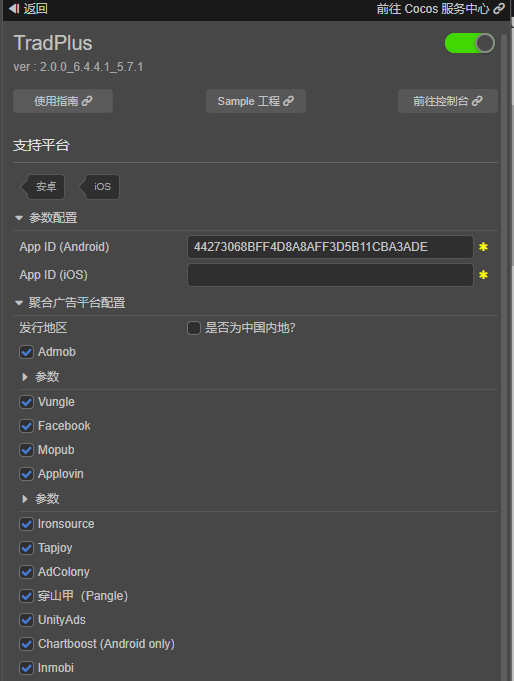

# TradPlus（聚合广告）快速入门

**（注意：更新标语，以及各个截图等）**

[TradPlus 聚合广告](https://www.tradplusad.com)，具有100%数据透明、全球广告资源、广告漏斗模型、智能优化算法、30 min快捷接入的产品优势，同时提供变现方案、数据分析、技术支持、托管服务、平台开户等服务。多达38种数据埋点，为您提供完整的变现“体检报告”，透视广告变现各个环节的流失率，实现精细化运营。协助开发者构建BI系统，形成数据运营闭环。为开发者提供收益最大化的广告变现解决方案，做开发者最专业的广告变现合作伙伴。

### 版本更新说明

- 当前版本：2.0.0_6.4.4.1_5.7.1

    -  新增 TradPlus 广告聚合平台。

## 一键接入 TradPlus 服务

### 开通服务

- 使用 Cocos Creator 打开需要接入 TradPlus 服务的项目工程。

- 点击菜单栏的 **面板 -> 服务**，打开 **服务** 面板，选择 **TradPlus**，进入服务详情页。然后点击右上方的 **启用** 按钮即可开通服务。详情可参考 [服务面板操作指南](./user-guide.md)。

  

- 如果您还没有 TradPlus 聚合广告平台的账号，请前往 [TradPlus](https://developer.tradplusad.com/) 进行注册，并根据[指引文档](https://docs.tradplusad.com/docs/Guide)进行相应的配置，获取服务面板所需要的 `App ID` 等参数。

* <font color="red">注：TradPlus 聚合广告在 iOS 和 Android 平台上需要创建不同的 App ID，两者不能公用同一个 App ID</font>

### 验证服务是否接入成功

- 完成 **TradPlus** 服务接入步骤后，我们便可以通过在脚本中添加简单的代码，来验证接入是否成功。

```ts
// 启用调试日志，仅测试时使用，上线前请注释掉
tradplus.tradPlusService.setEnableLog(true);
// 初始化SDK
tradplus.tradPlusService.initSdk();
// 启用测试模式，仅测试时使用，上线前请注释掉
tradplus.tradPlusService.setNeedTestDevice(true);
```

- 工程运行到手机后，Android平台在 Android Studio 中查看日志，过滤日志关键字【TradPlusLog】，iOS平台请在 Xcode 中查看日志，过滤日志关键字【TradPlus】。

## Sample 工程

开发者可以通过 Sample 工程快速体验性能管理服务。

- 点击性能管理服务面板中的 **Sample 工程** 按钮，Clone 或下载 TopOn Sample 工程，并在 Cocos Creator 中打开。

- 参照上文开通 TopOn 并配置相应参数后，可通过 Creator 编辑器菜单栏的 **项目 -> 构建发布** 打开 **构建发布** 面板来构建编译工程。

- Sample 工程运行到手机后，即可进入功能界面进行测试。

  

## 开发指南

完整的代码请参考 Sample 工程。

### 初始化SDK

首先，我们需要初始化SDK，初始化后才能调用广告相关的API。

初始化SDK代码如下：

```ts
// 初始化SDK，不需要参数App ID，我们会自动使用服务面板填写的App ID
tradplus.tradPlusService.initSdk();
```

开发过程中，如果需要查看调试日志，可以调用 `setEnableLog` ，如果需要开启测试模式，可以调用 `setNeedTestDevice` 。

故开发时，我们初始化代码一般如下：

```ts
// 启用调试日志，仅测试时使用，上线前请注释掉
tradplus.tradPlusService.setEnableLog(true);
// 初始化SDK
tradplus.tradPlusService.initSdk();
// 启用测试模式，仅测试时使用，上线前请注释掉
tradplus.tradPlusService.setNeedTestDevice(true);
```

**需要特别注意的是， `setEnableLog` 和 `setNeedTestDevice` 仅测试时使用，上线前请记得注释掉**

### 横幅广告

横幅广告使用步骤如下：

1. 传入广告位ID给 `getBanner` 以获取该广告位ID对应的横幅广告对象。

2. 调用 `banner.setAdListener` 设置横幅广告的事件监听器，以在该横幅广告相关事件发生时采取相应的动作。

3. 调用 `banner.loadAd` 加载并显示横幅广告。

完整代码如下：

```ts
const adUnitId = '您的横幅广告位ID';

const banner = tradplus.tradPlusService.getBanner(adUnitId);

banner.setAdListener({
  onAdLoaded: (adSourceName) => {
    // 在广告加载完成的时候触发，adSourceName为广告源名称
  },

  onAdClicked: () => {
    // 在广告被点击的时候触发
  },

  onAdLoadFailed: (adError) => {
    // 在广告加载失败的时候触发，adError包含了错误信息
  },

  onAdImpression: () => {
    // 在广告被展示的时候触发
  },

  onAdShowFailed: (adError) => {
    // 在广告显示失败的时候触发
    // 注：这个回调仅在Android平台下会触发
  },

  onAdClosed: () => {
    // 在广告被关闭后触发
    // 注：这个回调仅在Android平台下会触发
  },

  onBannerRefreshed: () => {
    // 在广告自动刷新时触发
    // 注：这个回调仅在Android平台下会触发
  },
});

// 在屏幕上方加载并显示横幅广告
this.banner.loadAd('top');
```

### 激励视频、插屏广告

激励视频和插屏广告的使用和横屏广告类似，请参考 Sample 工程及 [TradPlus - API 文档](https://service.cocos.com/document/api/modules/tradplus.html)。

### 隐私规范

隐私规范涉及 GDPR、CCPA、COPPA，可以参考 TradPlus 官方文档：[隐私规范（Android）](https://docs.tradplusad.com/docs/tradplussdk_android_doc_v6/ios_sdk_privacy) 或者 [隐私规范（iOS）](https://docs.tradplusad.com/docs/integration_ios/ios_sdk_privacy/android_sdk_gdpr)。

#### GDPR

如果应用需要发到欧盟区域，那需要特别注意下 GDPR 。

为了设置GDPR，我们需要如下步骤：

1. 在初始化SDK前设置GDPR监听器。

2. 在GDPR监听器的onSuccess中，判断GDPR是否适用，如果适用，调用API显示GDPR对话框，让用户自己选择GDPR等级。

完整初始化代码如下：

```ts
// 启用调试日志，仅测试时使用，上线前请注释掉
tradplus.tradPlusService.setEnableLog(true);

// 设置GDPR监听器，需要在初始化SDK之前调用
tradplus.privacy.setGDPRListener({
  onSuccess: () => {
    // 已知国家
    if (tradplus.privacy.isGDPRApplicable()) {
      // GDPR适用，此时调用showGDPR显示GDPR对话框，让用户自己选择GDPR等级
      this.console.log('GDPR is applicable');
      this.showGDPR();
    } else {
      this.console.log('GDPR is not applicable');
    }
  },
  onFailed: () => {
    // 未知国家，让用户自己选择GDPR等级
    this.console.log(
      'Unknown country, let the user choose the GDPR level'
    );
    this.showGDPR();
  },
});

// 初始化SDK
tradplus.tradPlusService.initSdk();

// 启用测试模式，仅测试时使用，上线前请注释掉
tradplus.tradPlusService.setNeedTestDevice(true);
```

#### CCPA

如果需要设置CCPA，请调用API `setCCPADoNotSell` ，false 表示加州用户均不上报数据， true 表示接收上报数据。

注意： `setCCPADoNotSell` 需要在初始化SDK之前调用。

```ts
tradplus.privacy.setCCPADoNotSell(false /* 或者 true */);
```

#### COPPA

如果需要设置COPPA，请调用API `setCOPPAIsAgeRestrictedUser` ，false 表明不是儿童， true 表明是儿童。

注意： `setCOPPAIsAgeRestrictedUser` 需要在初始化SDK之前调用。

```ts
tradplus.privacy.setCOPPAIsAgeRestrictedUser(true /* 或者 false */);
```

## API 文档

详细的功能接口和 API 说明，请参考 [TradPlus - API 文档](https://service.cocos.com/document/api/modules/tradplus.html)。
